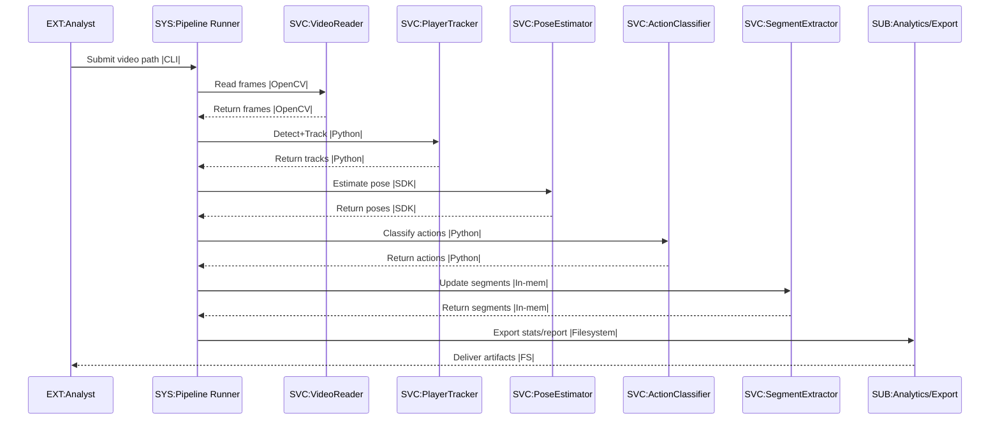
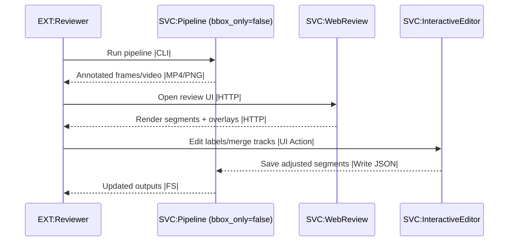
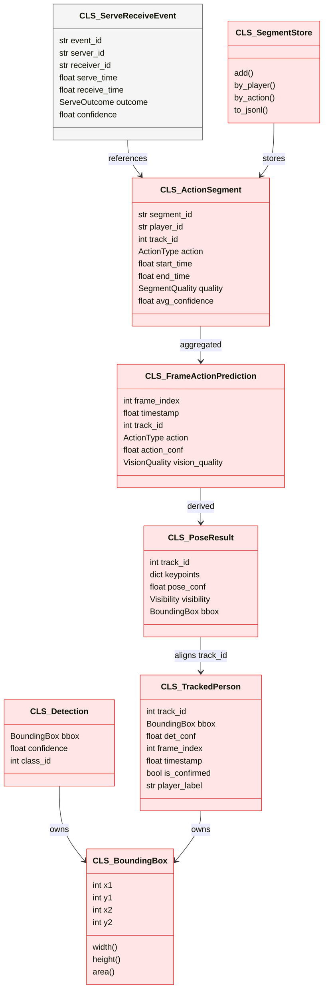

# Volleyball Analytics Architecture

## 1. Executive summary
- End-to-end Python pipeline that ingests volleyball video, detects players, tracks identities, estimates pose, classifies actions, extracts temporal segments, and exports analytics (JSON/CSV/HTML).
- Core critical path: `VideoReader -> PlayerDetector/ByteTrack -> PoseEstimator -> ActionClassifier -> SegmentExtractor -> TrackMerger/Analytics -> Export`.
- Targets offline/batch processing with optional real-time demo and human-in-loop review; outputs structured data and visuals for coaches/analysts.

## 2. Business requirements
- **Goals**: Accurate action timelines per player; stable IDs; serve/receive pairing; exportable stats/reports; configurable thresholds; GPU/CPU fallback.
- **Non-goals**: Generic sport detection; cloud orchestration; long-term DB persistence; deep learning training; full referee-quality scoring.
- **Constraints**: Runs on local workstation; YOLO/MediaPipe model weights available locally; FPS sensitivity for segment thresholds; optional stabilization disabled by default.
- **Success criteria**: >95% runtime completeness without crashes on 60–120 min videos; track continuity with minimal ID swaps; segments.jsonl + summary.json + player_stats.json generated; HTML report renders; serve/receive CSV produced.

## 3. Use cases
- **Primary**: Batch analyze a match video and generate segments/stats/report.
- **Secondary**: Batch multiple videos; real-time demo overlay for on-site review; human-in-loop web/interactive review and edit; query API for downstream analytics; serve/receive event extraction.
- **Edge cases**: Rotated video (`rotate_180`), shaky camera (stabilization on), low-confidence detections, crowded frames (>12 players), missing frames, very short clips (<5s).

## 4. Workflows
### 4.1 End-to-end batch processing (critical)
How to read: left-to-right lifelines; solid arrows are synchronous Python calls; notes show data artifacts; red is critical path.


### 4.2 Human-in-loop review
How to read: solid arrows are synchronous UI/API calls; dashed arrows are artifacts saved/read.


## 5. System architecture (top-down)
### 5.1 System Context (flowchart LR)
How to read: left-to-right; solid arrows are synchronous calls/data; colors show criticality/storage/external; legend explains classes.
```mermaid
flowchart LR
    SYS_VA[SYS: vAnalytics (video analytics)]:::critical
    EXT_USR[EXT: Analyst/Coach (runs jobs)]:::external
    EXT_VID[EXT: Video Source (MP4/MOV)]:::external
    STORE_OUT[STORE: Output Folder (JSON/HTML/MP4)]:::storage
    EXT_HW[EXT: GPU/CPU HW]:::external

    EXT_USR -->|Call via CLI/SDK| SYS_VA
    EXT_VID -->|Read via OpenCV| SYS_VA
    SYS_VA -->|Write via JSON/CSV/HTML| STORE_OUT
    SYS_VA -->|Compute via CUDA/CPU| EXT_HW
    EXT_USR -->|View via FS/Browser| STORE_OUT

    subgraph Legend
        L1[Critical]:::critical
        L2[Non-critical]:::noncritical
        L3[Storage]:::storage
        L4[External]:::external
        L5[In-memory]:::memory
    end

    classDef critical fill:#ffe5e5,stroke:#d33,stroke-width:1px;
    classDef noncritical fill:#f5f5f5,stroke:#666,stroke-width:1px;
    classDef storage fill:#e5f0ff,stroke:#3366cc,stroke-width:1px;
    classDef external fill:#fff4d6,stroke:#d6a700,stroke-width:1px;
    classDef memory fill:#f0e5ff,stroke:#8a2be2,stroke-width:1px;
```

### 5.2 Subsystem / Container View (flowchart LR)
How to read: LR flow of data; subgraphs group subsystems; red nodes are critical path; purple denotes in-memory caches.
```mermaid
flowchart LR
    EXT_VID[EXT: Video Source]:::external
    SUB_IO[SUB: Video I/O (read/write)]:::critical
    SUB_STAB[SUB: Stabilization]:::noncritical
    SUB_DT[SUB: Detection/Tracking]:::critical
    SUB_POSE[SUB: Pose]:::critical
    SUB_ACT[SUB: Action Classifier]:::critical
    SUB_SEG[SUB: Segmenter]:::critical
    SUB_ANALYTICS[SUB: Analytics & Export]:::critical
    SUB_VIS[SUB: Visualization/Reports]:::noncritical
    SUB_HIL[SUB: Human-in-Loop]:::noncritical
    STORE_OUT[STORE: Output Folder]:::storage

    EXT_VID -->|Read via OpenCV| SUB_IO
    SUB_IO -->|Send via numpy| SUB_STAB
    SUB_STAB -->|Forward via numpy| SUB_DT
    SUB_DT -->|Send tracks via Python| SUB_POSE
    SUB_POSE -->|Emit poses via SDK| SUB_ACT
    SUB_ACT -->|Emit actions via Python| SUB_SEG
    SUB_SEG -->|Emit segments via Python| SUB_ANALYTICS
    SUB_ANALYTICS -->|Write via JSON/CSV/HTML| STORE_OUT
    SUB_ANALYTICS -->|Render via Python| SUB_VIS
    SUB_VIS -->|Review via HTTP| SUB_HIL
    SUB_HIL -->|Push edits via JSON| SUB_SEG

    subgraph Legend
        L1[Critical]:::critical
        L2[Non-critical]:::noncritical
        L3[Storage]:::storage
        L4[External]:::external
        L5[In-memory]:::memory
    end

    classDef critical fill:#ffe5e5,stroke:#d33,stroke-width:1px;
    classDef noncritical fill:#f5f5f5,stroke:#666,stroke-width:1px;
    classDef storage fill:#e5f0ff,stroke:#3366cc,stroke-width:1px;
    classDef external fill:#fff4d6,stroke:#d6a700,stroke-width:1px;
    classDef memory fill:#f0e5ff,stroke:#8a2be2,stroke-width:1px;
```

### 5.3 Component View — Detection/Tracking (flowchart LR)
How to read: LR; grouped nodes inside Detection/Tracking; purple nodes are in-memory buffers; arrow labels show operation + medium.
```mermaid
flowchart LR
    subgraph SUB_DT[SUB: Detection/Tracking]
        SVC_DET[SVC: PlayerDetector (YOLO)]:::critical
        SVC_TRACKER[SVC: PlayerTracker (fusion)]:::critical
        MOD_YOLO[MOD: YOLO Model Loader]:::critical
        MOD_BT[MOD: ByteTrack Logic]:::critical
        MOD_COLOR[MOD: Color ReID Helper]:::noncritical
        MEM_BUF[MEM: Track Buffer (150f)]:::memory
    end
    SUB_STAB[SUB: Stabilization]:::noncritical
    SUB_POSE[SUB: Pose]:::critical

    SUB_STAB -->|Provide via numpy| SVC_DET
    SVC_DET -->|Detections via SDK| SVC_TRACKER
    SVC_TRACKER -->|Send tracks via Python| SUB_POSE
    SVC_TRACKER -->|Maintain IDs via buffer| MEM_BUF
    MOD_YOLO -->|Load weights via disk| SVC_DET
    MOD_BT -->|Assign IDs via Python| SVC_TRACKER
    MOD_COLOR -.->|Color hist reuse via numpy| SVC_TRACKER

    subgraph Legend
        L1[Critical]:::critical
        L2[Non-critical]:::noncritical
        L3[Storage]:::storage
        L4[External]:::external
        L5[In-memory]:::memory
    end

    classDef critical fill:#ffe5e5,stroke:#d33,stroke-width:1px;
    classDef noncritical fill:#f5f5f5,stroke:#666,stroke-width:1px;
    classDef storage fill:#e5f0ff,stroke:#3366cc,stroke-width:1px;
    classDef external fill:#fff4d6,stroke:#d6a700,stroke-width:1px;
    classDef memory fill:#f0e5ff,stroke:#8a2be2,stroke-width:1px;
```

### 5.4 Component View — Analytics/Export (flowchart LR)
How to read: LR; shows data products; blue nodes are persisted files.

```mermaid
flowchart LR
    SUB_SEG[SUB: Segmenter]:::critical
    SVC_STORE[SVC: SegmentStore]:::critical
    SVC_STATS[SVC: Stats Calculator]:::critical
    SVC_SR[SVC: ServeReceiveDetector]:::critical
    SVC_EXPORT[SVC: Exporters]:::critical
    SVC_REPORT[SVC: HTML Report]:::noncritical
    STORE_SEG[STORE: segments.jsonl]:::storage
    STORE_SUM[STORE: summary.json]:::storage
    STORE_SR[STORE: serve_receive.jsonl/csv]:::storage
    STORE_STATS[STORE: player_stats.json]:::storage
    STORE_HTML[STORE: report.html]:::storage

    SUB_SEG -->|Write via JSONL| STORE_SEG
    STORE_SEG -->|Load via Python| SVC_STORE
    SVC_STORE -->|Compute via Python| SVC_STATS
    SVC_STATS -->|Send stats via Python| SVC_EXPORT
    SVC_STORE -->|Serve segments via Python| SVC_SR
    SVC_SR -->|Emit events via Python| SVC_EXPORT
    SVC_EXPORT -->|Write via JSON| STORE_SUM
    SVC_EXPORT -->|Write via JSON| STORE_STATS
    SVC_EXPORT -->|Write via JSON/CSV| STORE_SR
    SVC_REPORT -->|Render via HTML| STORE_HTML

    subgraph Legend
        L1[Critical]:::critical
        L2[Non-critical]:::noncritical
        L3[Storage]:::storage
        L4[External]:::external
        L5[In-memory]:::memory
    end

    classDef critical fill:#ffe5e5,stroke:#d33,stroke-width:1px;
    classDef noncritical fill:#f5f5f5,stroke:#666,stroke-width:1px;
    classDef storage fill:#e5f0ff,stroke:#3366cc,stroke-width:1px;
    classDef external fill:#fff4d6,stroke:#d6a700,stroke-width:1px;
    classDef memory fill:#f0e5ff,stroke:#8a2be2,stroke-width:1px;
```


## 6. Data architecture
### 6.1 Core entities (classDiagram)
How to read: relationships point from owners to contained types; red classes are critical path data; blue indicates persisted/serialized forms.


### 6.2 Data flows and files
- In-memory stream: `Frame (np.ndarray) -> Detection -> TrackedPerson -> PoseResult -> FrameActionPrediction -> ActionSegment`.
- Persisted artifacts: `segments.jsonl`, `summary.json`, `player_stats.json`, `serve_receive.jsonl/csv`, optional `annotated.mp4`, `report.html`.
- Configurable thresholds (confidence, durations) drive segment boundaries; FPS-dependent min frames derived from `segment.min_duration_sec`.

## 7. Runtime + memory model
- Frames processed sequentially; at most one full frame and associated detections/poses/actions held concurrently.
- Track buffer retains ~150 frames of track history (ByteTrack) for re-ID; pose smoothing optionally uses short history.
- SegmentExtractor holds active segments per track plus finalized list; SegmentStore indexes segments in-memory for analytics before writing.
- Optional stabilization allocates feature buffers per frame; annotated video writing buffers one frame.
- TTL/eviction: Track buffer evicts after `track_buffer`; SegmentExtractor closes segments after `max_gap_frames`; label reuse expires after `_reuse_max_gap_frames`.

## 8. Code architecture (bottom-up)
- Repo layout: `volley_analytics/` packages (pipeline, video_io, stabilization, detection_tracking, pose, actions, segments, analytics, visualization, human_in_loop, common), `examples/`, `scripts/`, `configs/default.yaml`.
- Critical path files/classes:
  - `volley_analytics/pipeline/pipeline.py`: `Pipeline.run`, `_process_video`, `_export_results`, label assignment.
  - `volley_analytics/video_io/reader.py`: `VideoReader` (streaming frames); `video_io/color_normalize.py` (optional preprocessing).
  - `volley_analytics/stabilization/stabilizer.py`: `VideoStabilizer` (optional).
  - `volley_analytics/detection_tracking/detector.py`: `PlayerDetector` (YOLO inference).
  - `volley_analytics/detection_tracking/tracker.py` + `bytetrack.py`: `PlayerTracker`, `ByteTracker` (ID assignment and buffering).
  - `volley_analytics/pose/estimator.py`: `PoseEstimator` (MediaPipe), `Skeleton`.
  - `volley_analytics/actions/classifier.py`: `ActionClassifier`, `ActionResult`, `PoseFeatures`.
  - `volley_analytics/segments/extractor.py`: `SegmentExtractor`, `ActiveSegment`; `track_merger.py`: `merge_segments_by_track`.
  - `volley_analytics/analytics/store.py`: `SegmentStore`; `analytics/stats.py`: `compute_video_stats`; `analytics/serve_receive.py`: `ServeReceiveDetector`; `analytics/export.py`: JSON/CSV writers.
  - `volley_analytics/visualization/report.py`: `generate_html_report`.
  - `volley_analytics/pipeline/cli.py`: CLI wrapper; `pipeline/__main__.py` entrypoint.
- Helper/supporting files: `common/data_types.py` (Pydantic models), `common/config.py` (PipelineConfig), `human_in_loop/web_review.py` & `interactive_editor.py` (review/edit), `examples/*.py` (usage).

### 8.1 Key file responsibilities and criticality
- `pipeline/pipeline.py` (Critical): orchestrates stages, progress, exporting, label reuse; critical path state management.
- `video_io/reader.py` (Critical): frame streaming and metadata extraction; failure stops pipeline.
- `stabilization/stabilizer.py` (Non-critical): optional smoothing; disabled by default.
- `detection_tracking/detector.py` (Critical): YOLO inference; size/ROI filtering.
- `detection_tracking/tracker.py` & `bytetrack.py` (Critical): match detections across frames, maintain track buffer.
- `pose/estimator.py` (Critical): pose extraction and smoothing.
- `actions/classifier.py` (Critical): rule-based action inference from poses.
- `segments/extractor.py` (Critical): action boundary detection, merging, quality scoring; FPS-aware durations.
- `segments/track_merger.py` (Critical): post-merge track IDs to players; reduces fragmentation.
- `analytics/store.py` (Critical): in-memory indices and JSONL export; `stats.py` computes counts/durations.
- `analytics/serve_receive.py` (Critical): serve/receive matching heuristics; outputs JSONL/CSV via `export.py`.
- `visualization/report.py` (Non-critical): HTML dashboard rendering.
- `pipeline/cli.py` (Non-critical): argument parsing, progress bar.
- `human_in_loop/*.py` (Non-critical): review/edit utilities.

### 8.2 Critical path execution chain
- Ingest video -> detect -> track -> pose -> classify -> segment -> merge -> stats/serve_receive -> export files.
- Failure paths: missing video, model load failure, OpenCV read failure, pose inference errors, file write errors. Retries limited to underlying libraries; caller can rerun with different config. SegmentExtractor drops segments < `min_segment_frames` or low-confidence; TrackMerger reduces to `merge_max_players`.
- State transitions: tracks move from tentative to confirmed in ByteTrack; active segments start/close based on action continuity; labels reused if IoU within thresholds; exported files created after successful finalization.

### 8.3 Use Case → Workflow → Modules → Files → Classes/Functions
| Use Case | Workflow | Modules | Files | Classes/Functions | Criticality |
| --- | --- | --- | --- | --- | --- |
| Batch single video | Run pipeline, export artifacts | pipeline, video_io, detection_tracking, pose, actions, segments, analytics | `pipeline/pipeline.py`, `video_io/reader.py`, `detection_tracking/detector.py`, `detection_tracking/tracker.py`, `pose/estimator.py`, `actions/classifier.py`, `segments/extractor.py`, `analytics/export.py` | `Pipeline.run`, `VideoReader.read_frames`, `PlayerDetector.detect`, `PlayerTracker.process_frame`, `PoseEstimator.estimate_batch`, `ActionClassifier.classify`, `SegmentExtractor.update/finalize`, `export_summary` | Critical |
| Batch multiple videos | Iterate videos, aggregate | examples | `examples/batch_process.py` | `process_video`, aggregates SegmentStore | Non-critical wrapper |
| Real-time demo overlay | Stream frames with overlays | video_io, pipeline (process_frame), visualization | `examples/realtime_demo.py`, `pipeline/pipeline.py` | `Pipeline.process_frame`, OpenCV overlay loop | Critical (loop), Non-critical (UI) |
| Human-in-loop review | Render segments, edit labels | human_in_loop, pipeline outputs | `human_in_loop/web_review.py`, `human_in_loop/interactive_editor.py` | `review_segments`, `edit_tracks` | Non-critical |
| Serve/receive extraction | Derive events from segments | analytics | `analytics/serve_receive.py`, `analytics/export.py` | `ServeReceiveDetector.detect`, `export_serve_receive_events/csv` | Critical |
| Query analytics | Load and query segments | analytics | `analytics/store.py`, `analytics/query.py` | `SegmentStore.from_jsonl`, `SegmentQuery.execute` | Non-critical (post-processing) |

## 9. Cross-cutting concerns
- **Auth/Access**: None built-in; assumes local files. TODO: add optional auth if exposing web review externally.
- **Secrets/Models**: YOLO weights (`yolov8*.pt`), MediaPipe models must exist on disk; no secret manager.
- **Logging**: Config via `PipelineConfig.logging`; CLI sets logging level; progress callback for UI.
- **Metrics**: Not instrumented; stats computed per video (actions/minute, player counts) but no time-series telemetry. TODO: add processing time metrics.
- **Error handling**: File existence checks, try/finally around writer; catch exceptions in CLI; segment extraction skips short/idle segments; HTML generation guarded.
- **Rate limits**: None; throughput bounded by hardware. FPS throttling possible via config.
- **Configuration**: `configs/default.yaml` or env vars (`VOLLEY_*`). CLI overrides (model, confidence, stabilization).
- **Localization**: None.

## 10. Deployment + operations
- **Environments**: Local workstation (CPU/GPU); optional GPU via CUDA/MPS auto-detected. No cloud infra specified.
- **Config/flags**: `PipelineConfig` toggles stabilization, detection thresholds, tracking buffer, pose complexity, min segment duration, merge gap, export options.
- **Dependencies**: `ultralytics` for YOLO, `opencv-python`, `mediapipe` for pose, `pydantic` for models. Models must be downloaded (`yolov8n.pt` present).
- **Execution**: `python -m volley_analytics.pipeline.cli video.mp4 --output out --annotate`; library via `Pipeline.run(...)`.
- **Monitoring/Runbook**: Check logs; validate outputs exist; if detections missing, lower confidence or adjust ROI; if ID swaps, raise `track_buffer`/`match_thresh`; if HTML fails, rerun export only.
- **Feature flags**: stabilization on/off; bbox-only mode; rotate 180; save annotated video; merge tracks to `merge_max_players`.
- **Observability gaps**: No profiling/traces; no disk space checks. TODO: add processing stats to summary.

## 11. Risks + tradeoffs
- **Model dependence**: YOLO/MediaPipe accuracy bounds; rule-based classifier may mislabel complex plays; mitigated by human-in-loop edits.
- **Performance vs accuracy**: Small YOLO (`yolov8n`) faster but less accurate; ByteTrack thresholds tuned for retention, may increase false positives.
- **ID stability**: Color histogram reuse heuristic may fail under lighting changes; track merging heuristics can merge distinct players.
- **Temporal precision**: FPS-dependent thresholds; incorrect FPS metadata skews segment boundaries.
- **Resource usage**: GPU memory for YOLO; CPU-bound pose if GPU absent; optional stabilization adds CPU load.
- **Data quality**: Court detection optional; low visibility frames produce `NO_CALL` actions leading to sparse segments.
- **Operational gaps**: No automated tests for full pipeline with real videos; limited resilience to corrupted input files. TODO: add fixture-based integration run.
