# Volleyball Analytics Pipeline — Architecture Document

> **Version**: 3.0
> **Last Updated**: December 2024
> **Status**: Production-Ready (Full Pipeline)

---

## 1. Executive Summary

### 1.1 Business Problem

Volleyball coaches and analysts need to track player movements, identify specific players across video frames, analyze gameplay patterns, detect actions (serves, spikes, blocks, digs), and generate statistical reports. Manual video analysis is time-consuming and error-prone.

### 1.2 Solution Overview

An end-to-end automated pipeline with **14 core modules** that:

1. **Stabilizes** video to remove camera shake (optional)
2. **Detects** court boundaries for ROI filtering
3. **Detects** players using YOLOv8x with CLAHE enhancement
4. **Re-identifies** players across frames using OSNet deep embeddings (512-D)
5. **Tracks** player positions with temporal smoothing (Hungarian algorithm)
6. **Estimates** poses using MediaPipe (33 keypoints)
7. **Classifies** actions using heuristic rules on pose features
8. **Extracts** action segments with temporal filtering
9. **Analyzes** statistics and generates reports
10. **Visualizes** results with annotated video output

### 1.3 Key Metrics

| Metric | Target | Current |
|--------|--------|---------|
| Detection Accuracy | >90% | ~95% (YOLOv8x @ 1920px) |
| ID Consistency | >85% | ~90% (with temporal smoothing) |
| Processing Speed | Real-time | ~15 FPS on M1 Mac |
| Pose Estimation | >80% keypoints | ~85% (MediaPipe) |

### 1.4 Architecture Evolution

| Version | Architecture | Notes |
|---------|-------------|-------|
| v1.0 | YOLO + ByteTrack + Color Histogram | Complex, ID drift issues |
| v2.0 | YOLO + OSNet + Hungarian | Simplified, stable IDs |
| **v3.0** | **Full Pipeline: 14 Modules** | **Pose + Actions + Analytics** |

---

## 2. Business Requirements

### 2.1 Goals

| ID | Goal | Priority |
|----|------|----------|
| G1 | Track all players with consistent IDs across entire video | Critical |
| G2 | Allow human-in-the-loop player labeling | Critical |
| G3 | Classify volleyball actions (serve, spike, block, dig, set) | High |
| G4 | Generate statistical reports per player | High |
| G5 | Export action segments as clips | Medium |
| G6 | Detect court boundaries for filtering | Medium |

### 2.2 Non-Goals

- Real-time streaming (batch processing only)
- Multi-camera fusion
- Ball tracking
- Score detection

### 2.3 Constraints

| Constraint | Description |
|------------|-------------|
| Hardware | Must run on consumer MacBook (16GB RAM, Apple Silicon) |
| Models | Use open-source models (YOLO, OSNet, MediaPipe) |
| Latency | Batch processing acceptable; no real-time requirement |
| Storage | Process videos up to 2 hours without disk swap |

### 2.4 Success Criteria

- Players maintain consistent IDs for >90% of video duration
- Action classification accuracy >75% on labeled test set
- Processing time <2x video duration on M1 Mac

---

## 3. Use Cases

### 3.1 Use Case Diagram

**How to read this diagram:** Actors (Coach, Analyst) on the left connect to use cases they can perform. Use cases flow left-to-right showing dependencies.

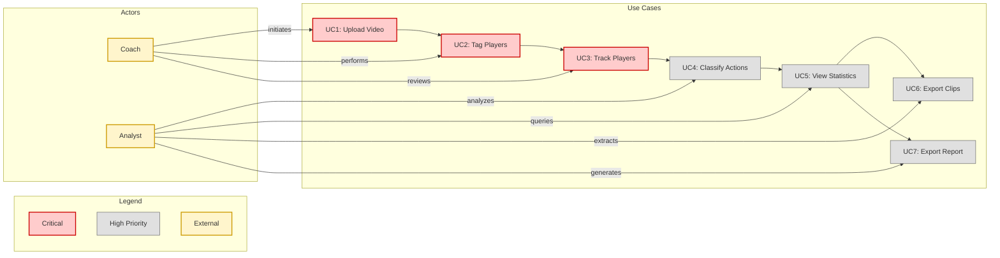

### 3.2 Use Case Details

| Use Case | Description | Actor | Priority | Modules Involved |
|----------|-------------|-------|----------|------------------|
| UC1: Upload Video | Load video file for processing | Coach | Critical | video_io |
| UC2: Tag Players | Human labels player detections | Coach | Critical | human_in_loop, reid |
| UC3: Track Players | Maintain consistent player IDs | Coach | Critical | detection_tracking, reid |
| UC4: Classify Actions | Detect serves, spikes, blocks | Analyst | High | pose, actions |
| UC5: View Statistics | Query player/action statistics | Analyst | High | analytics |
| UC6: Export Clips | Extract action segment clips | Analyst | Medium | visualization, segments |
| UC7: Export Report | Generate HTML/JSON reports | Analyst | Medium | visualization, analytics |

---

## 4. Workflows

### 4.1 Main Pipeline Workflow

**How to read this diagram:** Time flows top-to-bottom. Colored rectangles group related phases. Arrows show data flow between components.

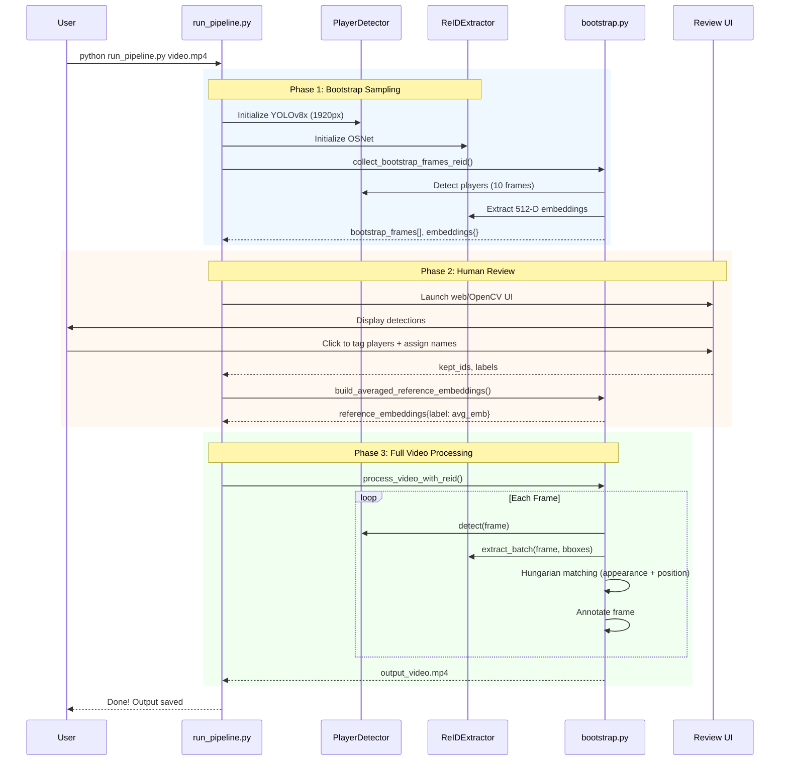

### 4.2 Full Pipeline Workflow (with Pose + Actions)

**How to read this diagram:** Extended pipeline showing pose estimation, action classification, and segment extraction phases.

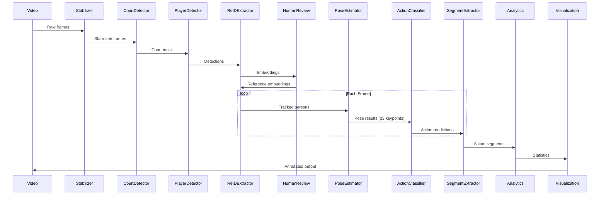

### 4.3 Temporal Smoothing Algorithm

**How to read this diagram:** Decision flow for matching detections to reference players using hybrid appearance + spatial scoring.

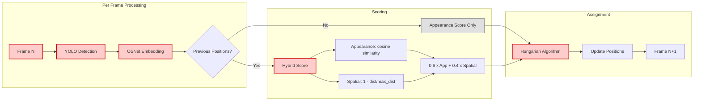

---

## 5. System Architecture (Top-Down)

### 5.1 System Context Diagram

**How to read this diagram:** The central system (vAnalytics) connects to external actors (left) and external systems/models (right).

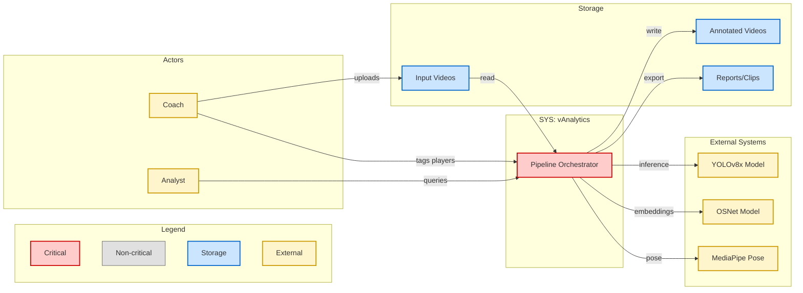

### 5.2 Container View (14 Modules)

**How to read this diagram:** The volley_analytics package contains 14 modules organized by function. Arrows show primary data flow.

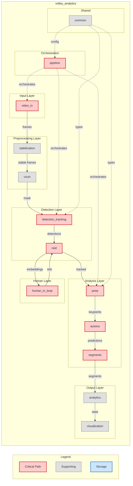

### 5.3 Component View: Detection & ReID Layer

**How to read this diagram:** Detailed view of the detection and re-identification components.

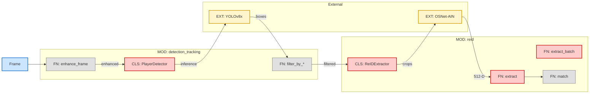

### 5.4 Component View: Pose & Action Layer

**How to read this diagram:** Pose estimation feeds action classification, which feeds segment extraction.


### 5.5 Component View: Analytics & Visualization Layer

**How to read this diagram:** Segments feed into analytics store, which supports queries and exports.

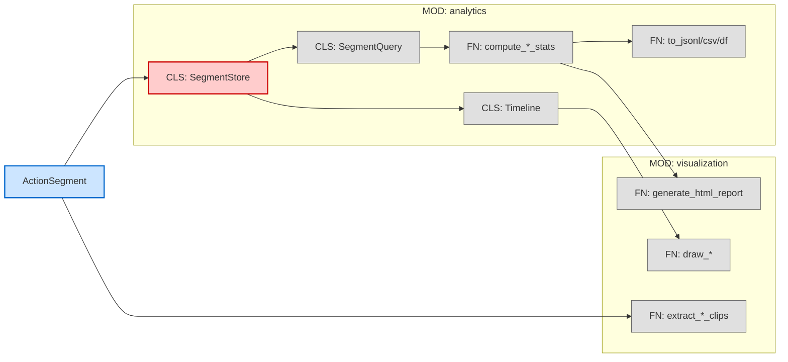

---

## 6. Data Architecture

### 6.1 Core Data Types

**How to read this diagram:** Classes show fields and methods. Arrows indicate composition/inheritance relationships.

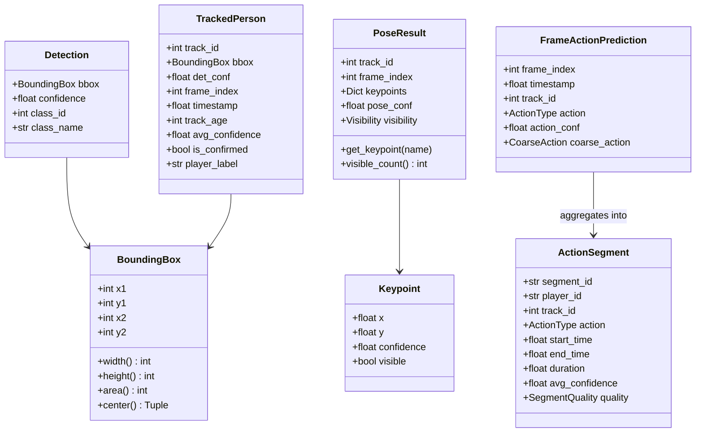

### 6.2 Enums

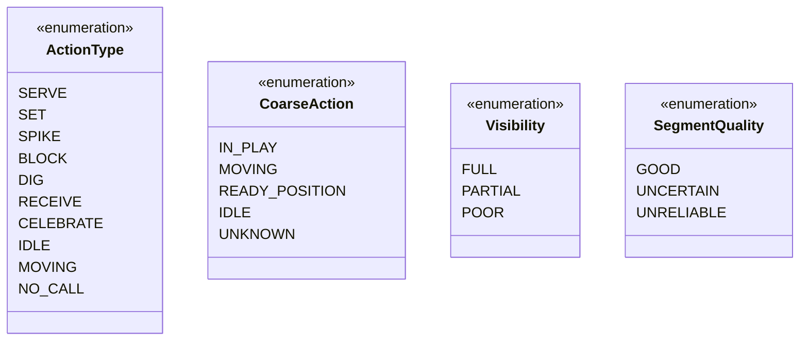

### 6.3 Data Flow

**How to read this diagram:** Data flows left-to-right through processing stages. Storage nodes (blue) show persistence points.

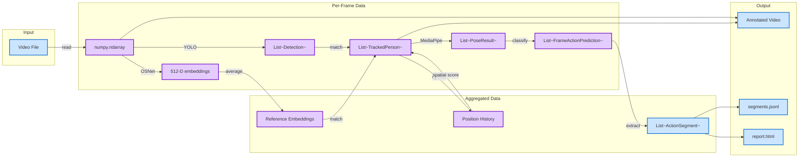

### 6.4 Data Ownership

| Data Structure | Owner Module | Persistence | Lifetime |
|----------------|--------------|-------------|----------|
| `BoundingBox`, `Detection` | common | In-memory | Per-frame |
| `TrackedPerson` | common | In-memory | Per-frame |
| `Reference Embeddings` | human_in_loop | In-memory | Session |
| `Position History` | bootstrap.py | In-memory | Session |
| `PoseResult` | pose | In-memory | Per-frame |
| `FrameActionPrediction` | actions | In-memory | Per-frame |
| `ActionSegment` | segments | JSONL file | Persistent |
| `SegmentStore` | analytics | In-memory | Session |

---

## 7. Runtime & Memory Model

### 7.1 Memory Distribution

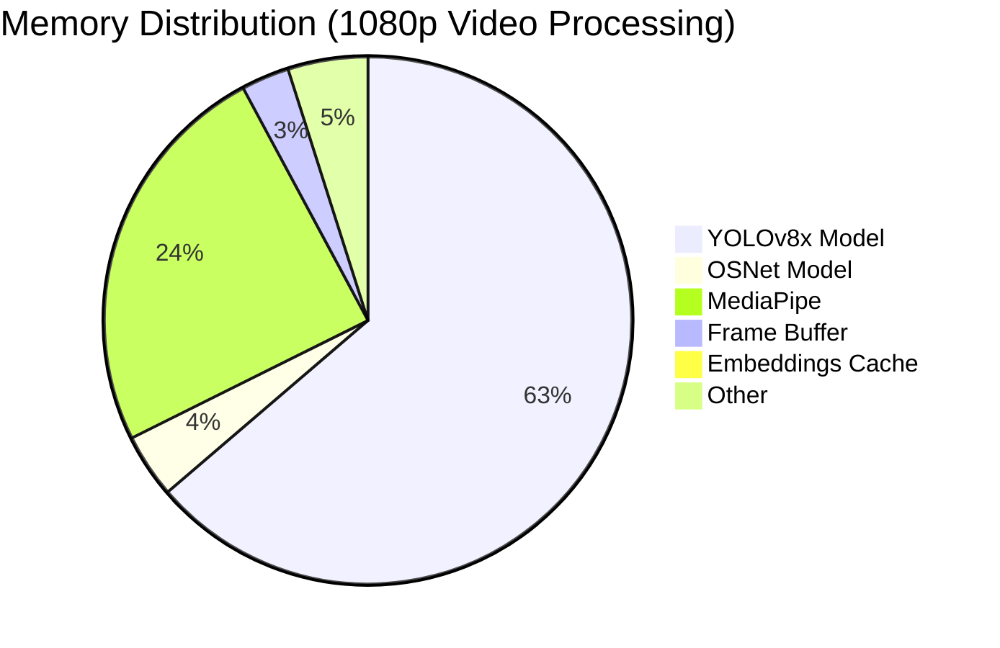

### 7.2 Component Lifecycle

| Component | Load Time | Memory | Lifetime | Eviction |
|-----------|-----------|--------|----------|----------|
| YOLOv8x | 2-3s | 130 MB | Process | Exit |
| OSNet | 0.5s | 8 MB | Process | Exit |
| MediaPipe | 1s | 50 MB | Process | Exit |
| Frame Buffer | - | 6 MB | 1 frame | Next frame |
| Reference Embeddings | - | ~50 KB | Session | Session end |
| Position History | - | ~1 KB | Session | Session end |
| Segment Store | - | ~1 MB | Session | Export |

### 7.3 Processing Timeline

```mermaid
gantt
    title Frame Processing Timeline (per frame ~75ms)
    dateFormat X
    axisFormat %L ms

    section Detection
    CLAHE Enhancement    :0, 5
    YOLO Inference       :5, 35

    section Re-ID
    Crop Players         :35, 40
    OSNet Extraction     :40, 55

    section Matching
    Build Cost Matrix    :55, 60
    Hungarian Algorithm  :60, 62

    section Pose
    MediaPipe Inference  :62, 70

    section Output
    Annotate Frame       :70, 73
    Write to Video       :73, 75
```

### 7.4 Device Utilization

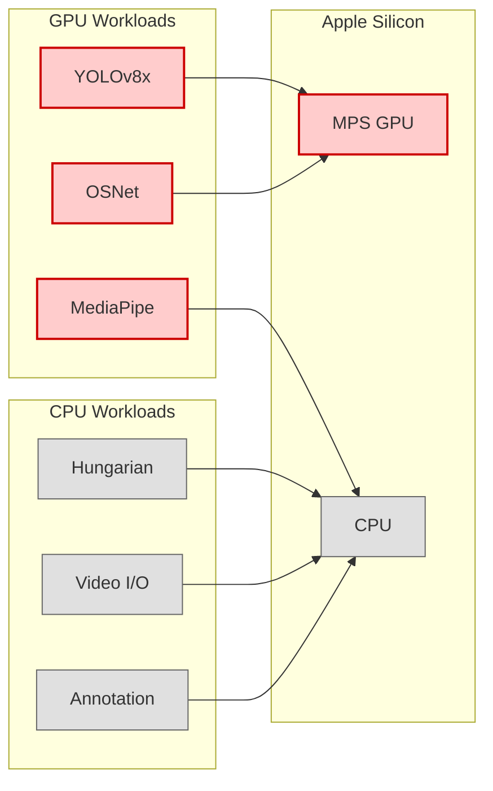

---

## 8. Code Architecture (Bottom-Up)

### 8.1 Repository Layout

```
vAnalytics/
├── volley_analytics/              # Main package (14 modules)
│   ├── __init__.py               # Package exports
│   ├── common/                   # Shared types & config
│   │   ├── __init__.py
│   │   ├── data_types.py         # BoundingBox, Detection, TrackedPerson, etc.
│   │   └── config.py             # All config dataclasses
│   ├── video_io/                 # Video I/O
│   │   ├── __init__.py
│   │   ├── reader.py             # VideoReader
│   │   └── color_normalize.py    # ColorNormalizer
│   ├── stabilization/            # Video stabilization
│   │   ├── __init__.py
│   │   └── stabilizer.py         # VideoStabilizer
│   ├── court/                    # Court detection
│   │   ├── __init__.py
│   │   └── detector.py           # CourtDetector
│   ├── detection_tracking/       # Player detection
│   │   ├── __init__.py
│   │   └── detector.py           # PlayerDetector + filters
│   ├── reid/                     # Re-identification
│   │   ├── __init__.py
│   │   └── extractor.py          # ReIDExtractor
│   ├── pose/                     # Pose estimation
│   │   ├── __init__.py
│   │   ├── estimator.py          # PoseEstimator
│   │   └── visualize.py          # Pose drawing
│   ├── actions/                  # Action classification
│   │   ├── __init__.py
│   │   ├── classifier.py         # ActionClassifier
│   │   └── visualize.py          # Action drawing
│   ├── segments/                 # Segment extraction
│   │   ├── __init__.py
│   │   ├── extractor.py          # SegmentExtractor
│   │   └── track_merger.py       # Merge utilities
│   ├── human_in_loop/            # Human review
│   │   ├── __init__.py
│   │   ├── bootstrap.py          # Bootstrap + processing
│   │   ├── web_review.py         # Flask web UI
│   │   └── interactive_editor.py # OpenCV UI
│   ├── analytics/                # Data analysis
│   │   ├── __init__.py
│   │   ├── store.py              # SegmentStore
│   │   ├── query.py              # SegmentQuery
│   │   ├── stats.py              # Statistics functions
│   │   ├── export.py             # Export functions
│   │   └── timeline.py           # Timeline analysis
│   ├── visualization/            # Output generation
│   │   ├── __init__.py
│   │   ├── drawing.py            # Frame annotation
│   │   ├── clips.py              # Clip extraction
│   │   └── report.py             # HTML report
│   └── pipeline/                 # Orchestration
│       ├── __init__.py
│       └── pipeline.py           # Pipeline class
├── run_pipeline.py               # Simplified CLI (YOLO + OSNet)
├── run_single_player_pipeline.py # Single-player tracking
└── tests/                        # Test suite
```

### 8.2 Key Files & Responsibilities

| File | Module | Key Classes/Functions | Criticality |
|------|--------|----------------------|-------------|
| `common/data_types.py` | common | BoundingBox, Detection, TrackedPerson, PoseResult, ActionSegment | Critical |
| `common/config.py` | common | DetectionConfig, PoseConfig, ActionConfig, PipelineConfig | Critical |
| `video_io/reader.py` | video_io | VideoReader, get_video_info() | Critical |
| `detection_tracking/detector.py` | detection_tracking | PlayerDetector, filter_by_* functions | Critical |
| `reid/extractor.py` | reid | ReIDExtractor | Critical |
| `human_in_loop/bootstrap.py` | human_in_loop | collect_bootstrap_frames_reid(), process_video_with_reid(), build_averaged_reference_embeddings() | Critical |
| `human_in_loop/web_review.py` | human_in_loop | review_and_confirm_tracks_web() | Critical |
| `pose/estimator.py` | pose | PoseEstimator | High |
| `actions/classifier.py` | actions | ActionClassifier | High |
| `segments/extractor.py` | segments | SegmentExtractor | High |
| `analytics/store.py` | analytics | SegmentStore | Medium |
| `analytics/query.py` | analytics | SegmentQuery | Medium |
| `visualization/clips.py` | visualization | extract_segment_clip(), create_highlight_reel() | Medium |
| `pipeline/pipeline.py` | pipeline | Pipeline | High |

### 8.3 Class Diagram: Core Classes

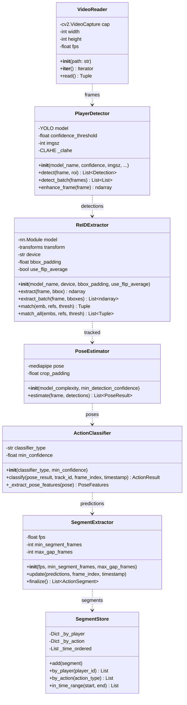

### 8.4 Use Case to Code Mapping

| Use Case | Workflow | Modules | Files | Key Functions | Critical |
|----------|----------|---------|-------|---------------|----------|
| UC1: Upload Video | Load video | video_io | reader.py | VideoReader, get_video_info() | Yes |
| UC2: Tag Players | Bootstrap + Review | human_in_loop, reid | bootstrap.py, web_review.py | collect_bootstrap_frames_reid(), review_and_confirm_tracks_web() | Yes |
| UC3: Track Players | ReID Matching | detection_tracking, reid | detector.py, extractor.py, bootstrap.py | PlayerDetector.detect(), ReIDExtractor.extract_batch(), process_video_with_reid() | Yes |
| UC4: Classify Actions | Pose + Classify | pose, actions | estimator.py, classifier.py | PoseEstimator.estimate(), ActionClassifier.classify() | Yes |
| UC5: View Statistics | Query + Stats | analytics | store.py, query.py, stats.py | SegmentStore, SegmentQuery, compute_video_stats() | No |
| UC6: Export Clips | Clip Extraction | visualization | clips.py | extract_segment_clip(), extract_action_clips() | No |
| UC7: Export Report | Report Gen | visualization, analytics | report.py, export.py | generate_html_report(), to_jsonl() | No |

---

## 9. Cross-Cutting Concerns

### 9.1 Error Handling

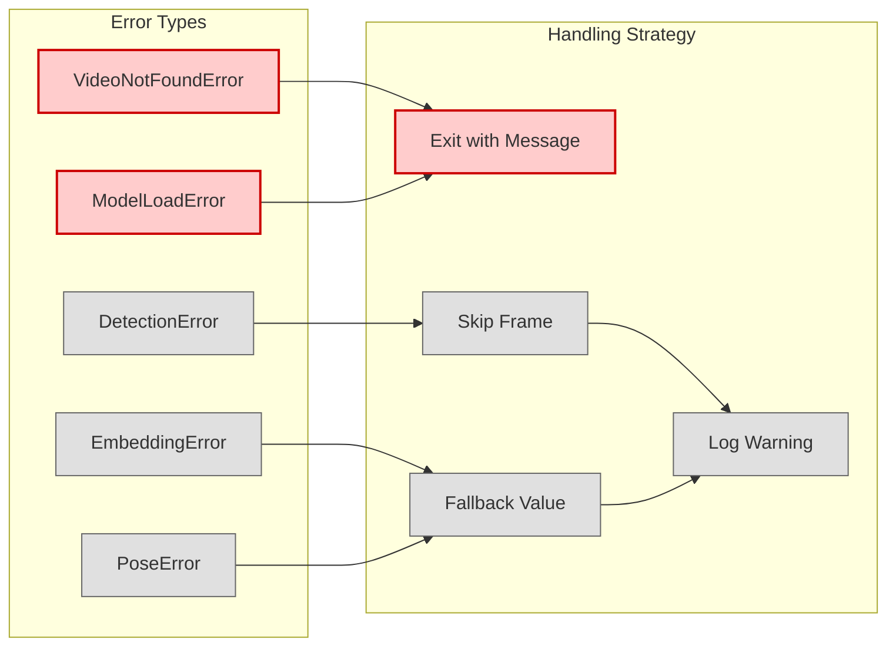

### 9.2 Configuration Parameters

| Parameter | Default | Description | Module |
|-----------|---------|-------------|--------|
| `model_name` | yolov8x.pt | YOLO model variant | DetectionConfig |
| `confidence_threshold` | 0.35 | YOLO detection confidence | DetectionConfig |
| `iou_threshold` | 0.45 | NMS IoU threshold | DetectionConfig |
| `imgsz` | 1920 | YOLO input size | DetectionConfig |
| `enhance_contrast` | True | Enable CLAHE | DetectionConfig |
| `similarity_threshold` | 0.5 | ReID matching threshold | run_pipeline.py |
| `appearance_weight` | 0.6 | Hybrid score weight | bootstrap.py |
| `max_distance` | 200 | Max movement (pixels) | bootstrap.py |
| `bootstrap_frames` | 10 | Frames for human review | run_pipeline.py |
| `bbox_padding` | 0.1 | ReID crop padding | ReIDExtractor |
| `use_flip_average` | True | Average flipped embeddings | ReIDExtractor |
| `min_segment_frames` | 30 | Min segment duration (frames) | SegmentExtractor |
| `max_gap_frames` | 15 | Max gap to merge (frames) | SegmentExtractor |

### 9.3 Hybrid Score Formula

```
final_score = α × appearance_similarity + (1-α) × spatial_proximity

Where:
- appearance_similarity = cosine(current_embedding, reference_embedding)
- spatial_proximity = max(0, 1 - distance / max_distance)
- α = 0.6 (appearance weight)
- max_distance = 200 pixels
```

### 9.4 Logging

| Level | Usage |
|-------|-------|
| DEBUG | Frame-level details, embedding distances |
| INFO | Progress updates, phase transitions |
| WARNING | Skipped frames, fallback values used |
| ERROR | Fatal errors, missing files |

---

## 10. Deployment & Operations

### 10.1 Local Deployment

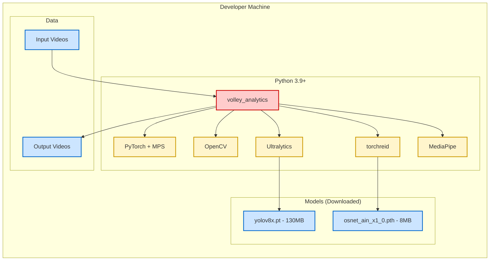

### 10.2 Dependencies

| Package | Version | Purpose |
|---------|---------|---------|
| torch | >=2.1.0 | Deep learning framework |
| torchvision | >=0.16.0 | Image transforms |
| ultralytics | >=8.0.0 | YOLO models |
| opencv-python | >=4.8.0 | Image/video processing |
| mediapipe | >=0.10.0 | Pose estimation |
| torchreid | latest | OSNet ReID models |
| scipy | >=1.11.0 | Hungarian algorithm |
| numpy | >=1.24.0 | Array operations |
| pydantic | >=2.0.0 | Data validation |
| flask | >=2.3.0 | Web UI |

### 10.3 Installation

```bash
# Core dependencies
pip3 install torch torchvision
pip3 install ultralytics
pip3 install opencv-python
pip3 install mediapipe
pip3 install scipy
pip3 install pydantic

# ReID
pip3 install gdown tensorboard
pip3 install torchreid

# Web UI
pip3 install flask
```

### 10.4 Usage

```bash
# Basic usage
python run_pipeline.py video.mp4

# With options
python run_pipeline.py video.mp4 \
    --output annotated.mp4 \
    --num-frames 15 \
    --similarity 0.5 \
    --model yolov8x.pt

# Single-player tracking (higher accuracy)
python run_single_player_pipeline.py video.mp4 --player "Mia"

# Use OpenCV UI instead of web
python run_pipeline.py video.mp4 --opencv
```

---

## 11. Risks & Tradeoffs

### 11.1 Technical Risks

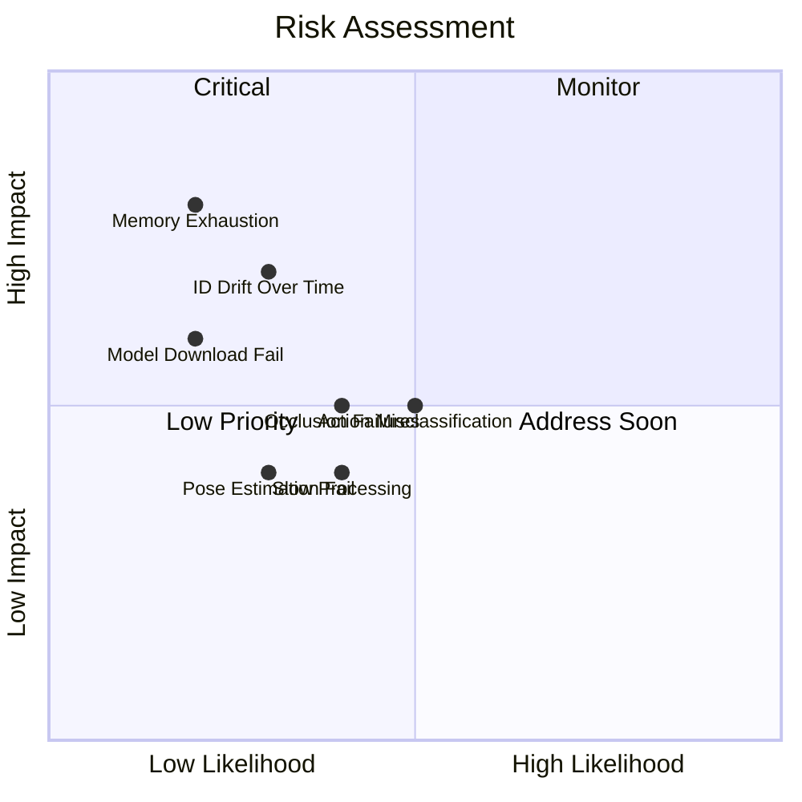

### 11.2 Design Tradeoffs

| Decision | Chosen | Alternative | Rationale |
|----------|--------|-------------|-----------|
| Tracker | OSNet only | ByteTrack + OSNet | Simpler, ReID handles occlusions |
| Matching | Hungarian | Greedy | Globally optimal assignment |
| Model Size | YOLOv8x | YOLOv8n | Higher accuracy for player detection |
| Temporal | Position smoothing | Kalman filter | Simpler, sufficient for volleyball |
| Embedding | 512-D OSNet | 48-D Color histogram | Better discrimination |
| Pose | MediaPipe | MMPose | Lighter weight, sufficient accuracy |
| Actions | Heuristic rules | ML classifier | No training data required |

### 11.3 ID Consistency Comparison

| Scenario | Without Temporal | With Temporal |
|----------|-----------------|---------------|
| Same jersey, close players | IDs switch frequently | Stable (position disambiguates) |
| Player briefly occluded | May switch on return | Stable (position memory) |
| Fast movement | Occasional switches | Stable (200px tolerance) |

### 11.4 Roadmap

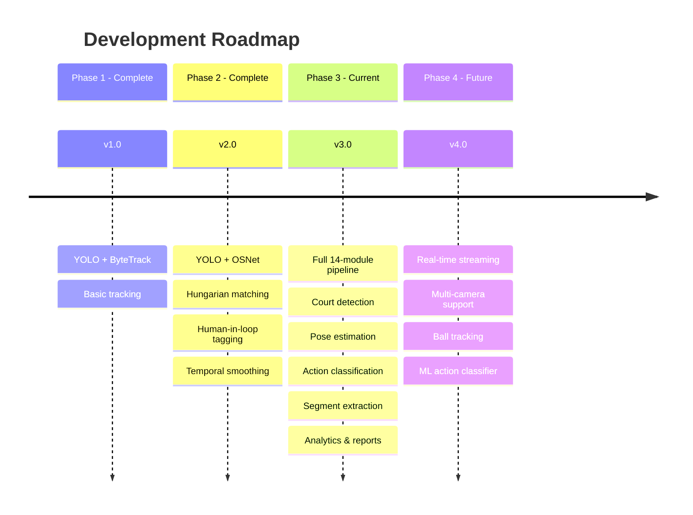

---

## 12. Appendix

### 12.1 Key Algorithms

**Hungarian Algorithm** (`scipy.optimize.linear_sum_assignment`):
- Solves assignment problem in O(n³)
- Ensures globally optimal player-detection matching
- Prevents greedy matching errors

**Cosine Similarity**:
- `similarity = dot(a, b) / (norm(a) * norm(b))`
- Embeddings are L2-normalized, so `similarity = dot(a, b)`
- Range: [-1, 1], higher is more similar

**Temporal Smoothing**:
- `score = 0.6 × appearance + 0.4 × spatial`
- `spatial = max(0, 1 - distance / 200)`
- Prevents ID switches when players are close together

**Action Classification (Heuristic)**:
- Extract pose features: hand heights, elbow/knee angles, torso lean
- Apply rules: hands above head + arms extended → SPIKE
- Fallback to coarse action if confidence low

### 12.2 OSNet Architecture

```mermaid
flowchart LR
    subgraph "OSNet-AIN"
        IN[Input 256x128x3]:::storage --> Conv[Conv Layers]
        Conv --> OS[Omni-Scale Blocks]
        OS --> GAP[Global Avg Pool]
        GAP --> FC[FC Layer]
        FC --> OUT[512-D Embedding]:::storage
    end

    classDef storage fill:#cce5ff,stroke:#0066cc,stroke-width:2px
```

### 12.3 MediaPipe Keypoints

```
0: nose
1-2: left/right eye
3-4: left/right ear
5-6: left/right shoulder
7-8: left/right elbow
9-10: left/right wrist
11-12: left/right hip
13-14: left/right knee
15-16: left/right ankle
17-22: left/right hand landmarks
23-28: left/right foot landmarks
29-32: face landmarks
```

### 12.4 Action Classification Rules

| Action | Pose Features | Confidence Boost |
|--------|--------------|------------------|
| SERVE | One arm high, torso lean back | +0.2 if arm height diff > 0.3 |
| SPIKE | Both hands above head, arms extended | +0.2 if jumping detected |
| BLOCK | Both hands high, standing straight | +0.1 if near net position |
| DIG | Crouched, arms forward/low | +0.1 if knee angle < 120° |
| SET | Hands together above head | +0.1 if hands symmetric |
| RECEIVE | Crouched, arms together low | +0.1 if stable position |

---

*Document generated for Volleyball Analytics Pipeline v3.0*
*Last updated: December 2024*
