## 🎯 WHAT YOU GET

- Interactive web viewer to watch all receive actions with video clips
- See full game video with clickable receive list in sidebar
- Individual clips for each receive with player ID and confidence labels

## 📊 THE CHANGE

```mermaid
flowchart LR
    INPUT["📥 Input<br/>Tracked video<br/>+ segments.json"] --> NEW1["🆕 receives_viewer.py<br/>Flask server<br/>HTML template"]
    NEW1 --> MOD1["✏️ clips.py<br/>extract_receive_clips()<br/>added"]
    MOD1 --> NEW2["🆕 view_receives.py<br/>launcher script"]
    NEW2 --> OUTPUT["📤 Output<br/>Web UI at :8080<br/>+ receive clips"]

    style INPUT fill:#e3f2fd,stroke:#1976d2,stroke-width:3px
    style NEW1 fill:#c8e6c9,stroke:#2e7d32,stroke-width:3px
    style MOD1 fill:#fff9c4,stroke:#f57f17,stroke-width:3px
    style NEW2 fill:#c8e6c9,stroke:#2e7d32,stroke-width:3px
    style OUTPUT fill:#fce4ec,stroke:#c2185b,stroke-width:3px
```



## 💡 EXAMPLE

**Before:**
```
You have segments.json with receive actions but no easy way to review them visually
```

**After:**
```
You get a web interface at http://localhost:8080 showing the full video with all receives listed, each clickable to view individual clips
```

**Command:**
```bash
python examples/view_receives.py output/
```
