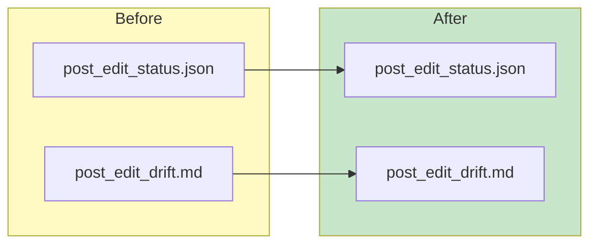

```markdown
## 🆔 Report
- Report ID: post-1766764708
- Branch: main
- Generated: 2025-12-26T15:58:28Z

## 🎯 WHAT CHANGED
- Updated `post_edit_status.json` with a new run timestamp and report ID.
- Enhanced `post_edit_drift.md` with updated metadata and change descriptions.
- Added a modified Mermaid flowchart to visualize the changes.

## 📊 THE CHANGE (ONE SIMPLE DIAGRAM)


## 💡 WHAT THIS FIXES
- **Problem:** Previously, the system's capability to manage serve-receive events was limited and player identification processes lacked human verification.
- **Solution:** The update improves serve-receive event handling by introducing new data structures and integrates human-in-the-loop verification with a web UI for enhanced player tagging accuracy.
```